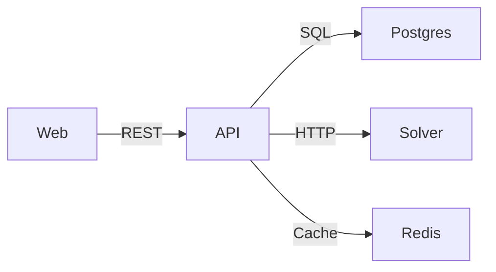
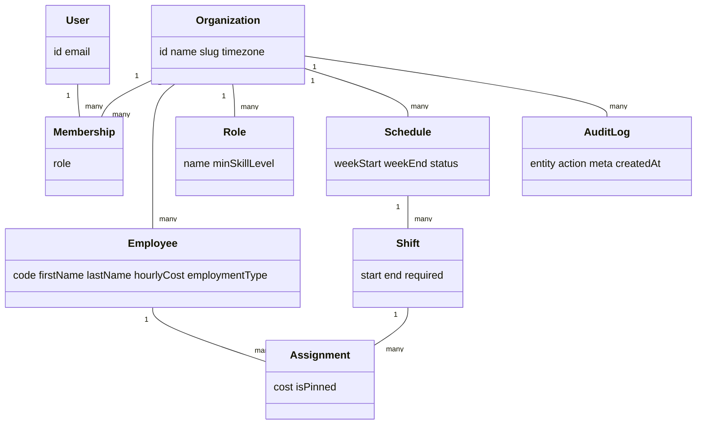

# ShiftSense (FS-SS)

Scheduling SaaS with a CP-SAT constraint solver and demand forecasting.

## Stack
- **Web**: Next.js (App Router), TailwindCSS
- **API**: NestJS, Prisma, PostgreSQL, Redis cache, Swagger
- **Solver**: Python FastAPI + OR-Tools, statsmodels
- **Optional**: Redpanda (Kafka-compatible) for local events

## Services & Ports
- Web: http://localhost:3000
- API: http://localhost:4000 → Swagger at `/api/docs`
- Solver: http://localhost:5001
- Postgres: localhost:5432
- Redis: localhost:6379

## Architecture

## ERD (high level)


## Quick start (dev)
```bash
pnpm install
pnpm db:migrate
pnpm db:seed
pnpm dev:all
# API docs: http://localhost:4000/api/docs
# UI roster: http://localhost:3000/roster
```

## Smoke tests
```bash
# list orgs
curl http://localhost:4000/api/orgs

# demand templates
curl http://localhost:4000/api/orgs/demo/demand

# generate schedule for week
curl -X POST http://localhost:4000/api/orgs/demo/schedules/generate   -H "content-type: application/json" -d '{"weekStartISO":"2025-09-29"}'

# pick a schedule id
SID=$(curl -s http://localhost:4000/api/orgs/demo/schedules | jq -r '.[0].id')

# solve
curl -X POST http://localhost:4000/api/orgs/demo/schedules/$SID/solve   -H "content-type: application/json" -d '{}'

# show schedule with assignments
curl http://localhost:4000/api/schedules/$SID
```

## Features
- Hard constraints: coverage, no overlap, rest windows, max weekly hours
- Soft costs: wage cost, casual penalty, consecutive days
- Pin/unpin assignments and re-solve without breaking pins
- Demand templates → schedule generation
- Forecast `/forecast` with statsmodels and rolling backtests
- Audit log (service + UI page)
- Swagger API docs

## Dev Notes
- Global API prefix: `/api`
- Add `x-api-key` header for protected writes (configurable)
- Prisma schema lives in `apps/api/prisma/schema.prisma`
- Solver URL: `http://127.0.0.1:5001` (config via `SOLVER_URL`)
- Redis URL: `redis://127.0.0.1:6379`

## Screens to build (UI)
- Roster: day columns, pinned badge, re-solve
- Runs: list, re-solve with weights, diff two runs
- Forecast: upload history, horizon toggle, CSV export
- Audit: filter by entity/user/date
