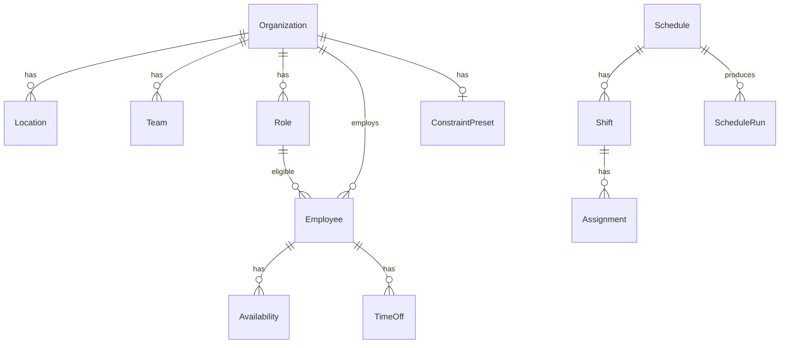

# ShiftSense

End-to-end, local-first staff rostering & demand forecasting stack:
- **API (NestJS)** on port **4000** with Postgres + Prisma, Redis cache, OpenAPI docs.
- **Web (Next.js / App Router)** on port **3000**.
- **Solver (FastAPI + OR-Tools)** on port **5001** for schedule optimization & simple time-series forecasting.
- **Infra**: Postgres 16, Redis 7 via Docker Compose.

> Windows PowerShell examples shown; macOS/Linux are equivalent.

---

## Features

- Organizations, employees, roles, teams, locations  
- Demand templates → **Generate** weekly schedules  
- **Solve** (CP-SAT) with availability, time-off, weekly cap, rest gap, role eligibility  
- **Pin/Unpin** assignments with re-solve respect  
- **Audit log** (pin/unpin, preset save) with UI  
- **Forecast** endpoint (AR + backtests) for daily demand  
- **Redis caching** for GETs (org, employees, schedules, demand) with write-side busting  
- **OpenAPI** docs at `/api/docs`

---

## Stack

- **API**: NestJS 11, Prisma 5.22, PostgreSQL, Redis, Swagger, Axios (to Solver)  
- **Web**: Next.js 14 (App Router), Tailwind  
- **Solver**: FastAPI, OR-Tools, NumPy/Pandas/Statsmodels  
- **DX**: pnpm workspaces, Docker Compose, `concurrently`

---

## Architecture

```mermaid
flowchart LR
  subgraph Web[Web (Next.js)]
    UI1[Roster]
    UI2[Runs]
    UI3[Audit]
    UI4[Forecast]
  end

  subgraph API[NestJS API :4000]
    CTRL[Controllers]
    SRV[Services]
    AUD[AuditService]
    RED[RedisService]
  end

  subgraph DB[Postgres 16]
    PRISMA[(Prisma schema)]
  end

  subgraph Cache[Redis 7]
    RDS[(Keys: org:*, schedule:*, demand:*)]
  end

  subgraph Solver[FastAPI :5001]
    SOLVE[ /solve (CP-SAT) ]
    FCST[ /forecast (AR+backtest) ]
  end

  Web <--> API
  API -- Prisma --> DB
  API -- RedisService --> Cache
  API -- Axios --> Solver
```

---

## ERD (high-level)


---

## Getting started

### 1) Prereqs
- Node 20+ (v23 OK), **pnpm** 8/10  
- Python 3.11+, `uvicorn`  
- Docker Desktop (for Postgres + Redis)

### 2) Install deps
```powershell
pnpm install
```

### 3) Start infra (Postgres + Redis)
```powershell
docker compose up -d db redis
```

### 4) API database & seed
```powershell
pnpm -C apps/api exec prisma migrate dev --schema prisma/schema.prisma
pnpm -C apps/api run db:seed
```

### 5) Run everything (dev)
```powershell
pnpm dev:all
```
- Web: http://localhost:3000  
- API: http://localhost:4000  
- Solver: http://127.0.0.1:5001  
- Swagger: http://localhost:4000/api/docs

> Or use the provided `docker-compose.yml` to run all services.

---

## Quick smoke tests (curl)

```powershell
# Orgs
curl http://localhost:4000/api/orgs
curl http://localhost:4000/api/orgs/demo

# Employees & demand
curl http://localhost:4000/api/orgs/demo/employees
curl http://localhost:4000/api/orgs/demo/demand

# Generate a schedule
curl -X POST http://localhost:4000/api/orgs/demo/schedules/generate ^
  -H "content-type: application/json" ^
  -d "{\"weekStartISO\":\"2025-09-29\"}"

# List schedules & get details
curl http://localhost:4000/api/orgs/demo/schedules
curl http://localhost:4000/api/schedules/<scheduleId>

# Solve a schedule
curl -X POST http://localhost:4000/api/orgs/demo/schedules/<scheduleId>/solve -H "content-type: application/json" -d "{}"

# Pin / Unpin
curl -X PATCH http://localhost:4000/api/assignments/<assignmentId>/pin
curl -X PATCH http://localhost:4000/api/assignments/<assignmentId>/unpin
```

---

## Redis caching

**Keys**
- Org: `org:list`, `org:<id>`  
- Employees: `org:<orgId>:employees:list`  
- Schedules: `schedules:list:<orgId>`, `schedule:<id>`, `schedule:<id>:summary`  
- Demand: `demand:<orgId>:all`, `demand:<orgId>:<locationId>`

**Bust on writes** is implemented in services (create/update/delete/pin/preset).

Inspect:
```powershell
docker exec -it redis redis-cli KEYS "*"
docker exec -it redis redis-cli GET "schedule:<id>"
```

---

## Forecast

**API → Solver**: `POST /api/orgs/:orgRef/forecast` builds series from demand templates and forwards to Solver `/forecast`:

```json
{
  "series": [{"ds":"2025-09-01","y":5}],
  "horizon_days": 14,
  "seasonal_period": 7,
  "backtest_folds": 3
}
```

Solver returns `history`, `forecast.yhat`, confidence bands, and `backtest.mape` per fold.  
UI shows history vs forecast with horizon toggle.

---

## Demo script

1. Open **/roster** → see week & total cost.  
2. Open **/runs** → re-solve; runs list updates.  
3. Open **/audit** → pin/unpin on Roster, then refresh Audit.  
4. Open **/forecast** → try horizons (7/14/28).  

Screenshots to capture:
- Roster (pinned badge)
- Runs (objective)
- Audit table
- Forecast chart (history vs yhat)

---

## Useful scripts

```powershell
pnpm -C apps/api exec prisma migrate status
pnpm -C apps/api exec prisma studio

# if configured
pnpm -C apps/api lint
pnpm -C apps/web lint
```

---

## Roadmap

- Persist forecast backtests → show MAPE per fold in UI  
- Unit tests (Prisma repos, solver payload builder, audit service)  
- E2E: generate → solve → pin → re-solve  
- ESLint + Prettier + CI  
- API key guard + basic role guard on write routes  
- Roster: day columns, drag to reassign, filters  
- Runs: diff two runs (cost & assignment deltas)  
- Optional: Prophet backend; event stream to Redpanda

---

## License

MIT (demo/portfolio).
